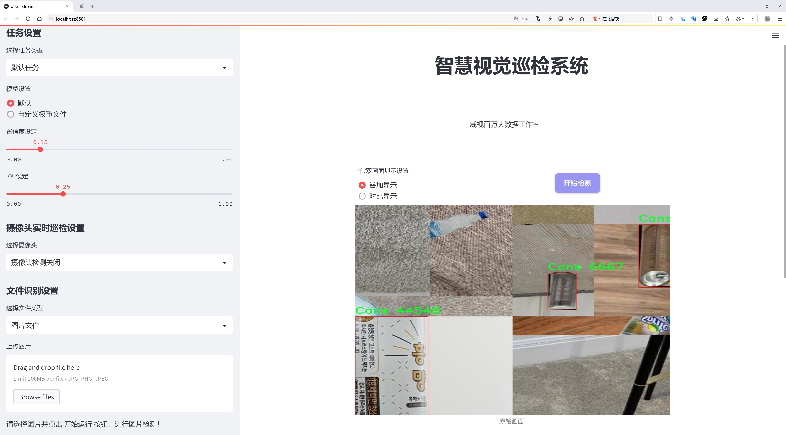
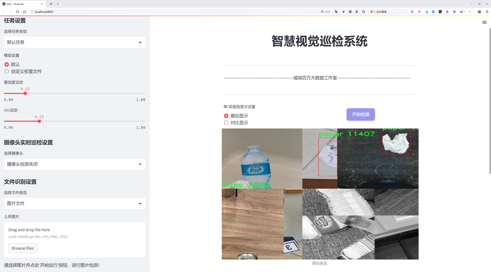
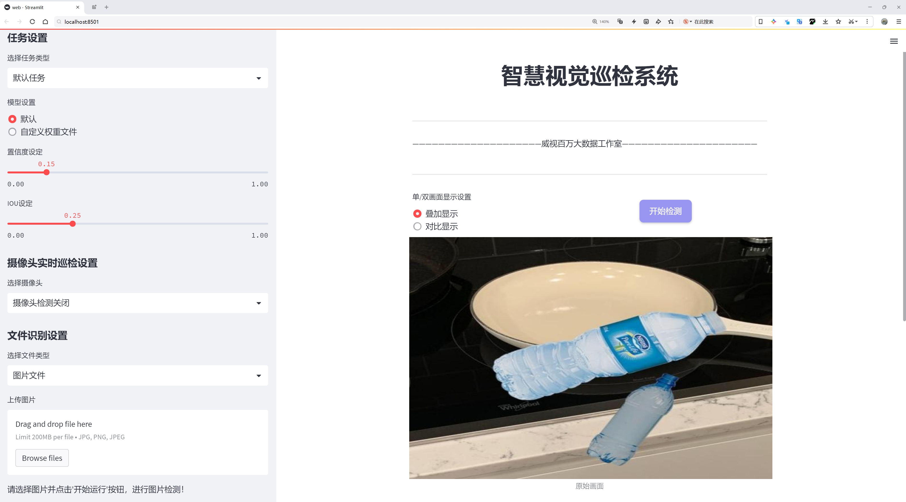
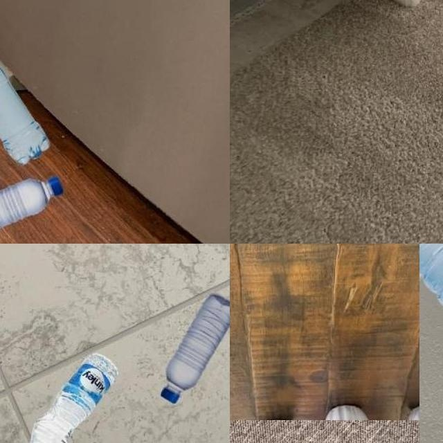
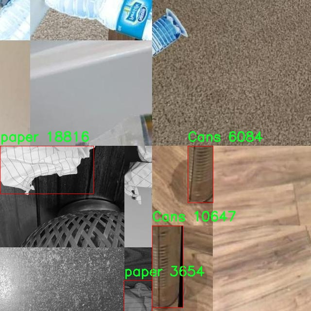
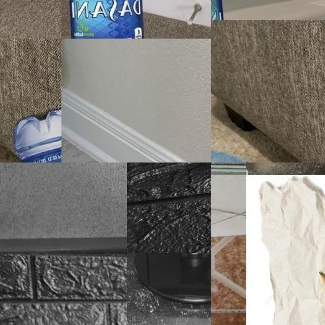
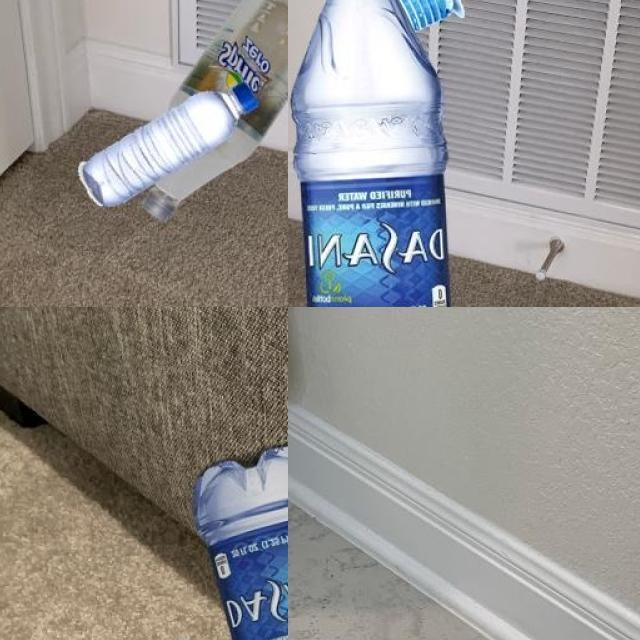
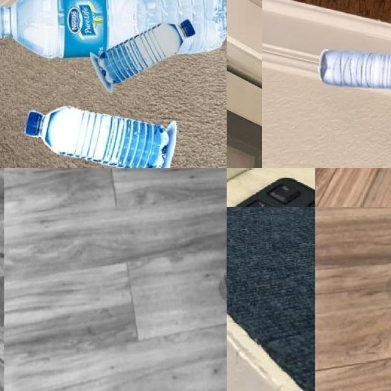

# 垃圾分类目标检测检测系统源码分享
 # [一条龙教学YOLOV8标注好的数据集一键训练_70+全套改进创新点发刊_Web前端展示]

### 1.研究背景与意义

项目参考[AAAI Association for the Advancement of Artificial Intelligence](https://gitee.com/qunmasj/projects)

研究背景与意义

随着城市化进程的加快和人口的不断增长，垃圾处理问题日益凸显，成为全球范围内亟待解决的环境问题之一。垃圾分类作为一种有效的资源回收和环境保护手段，不仅能够减少垃圾的总量，还能提高资源的再利用率，降低对自然资源的消耗。近年来，随着人工智能技术的迅猛发展，基于深度学习的目标检测技术在垃圾分类领域展现出了巨大的潜力。尤其是YOLO（You Only Look Once）系列模型，以其高效的实时检测能力和较高的准确率，成为垃圾分类自动化系统的重要选择。

在众多YOLO模型中，YOLOv8作为最新版本，进一步提升了检测精度和速度，适应了更复杂的应用场景。然而，现有的YOLOv8模型在特定领域的应用中仍存在一些不足，尤其是在垃圾分类这一细分领域。传统的垃圾分类方法往往依赖于人工识别，效率低下且容易受到人为因素的影响。因此，基于改进YOLOv8的垃圾分类目标检测系统的研究，具有重要的理论价值和实际意义。

本研究所使用的数据集“new3class”包含4965张图像，涵盖了四个类别：罐子、瓶子、物体和纸张。这一数据集的构建不仅为模型的训练提供了丰富的样本，也为后续的模型评估和优化奠定了基础。通过对这些类别的深入分析，可以发现，垃圾分类不仅涉及到物体的外观特征，还与物体的材质、形状等多种因素密切相关。因此，改进YOLOv8模型的特征提取能力，使其能够更好地识别和分类这些不同类型的垃圾，将极大地提升垃圾分类的准确性和效率。

此外，基于改进YOLOv8的垃圾分类目标检测系统的研究，能够为智能垃圾分类设备的研发提供理论支持和技术保障。随着智能城市建设的推进，智能垃圾分类设备逐渐成为城市管理的重要组成部分。通过将深度学习技术与垃圾分类相结合，可以实现对垃圾的自动识别和分类，从而提高垃圾处理的智能化水平，降低人工成本，提升城市环境管理的效率。

总之，基于改进YOLOv8的垃圾分类目标检测系统的研究，不仅具有重要的学术价值，还有助于推动垃圾分类技术的进步和应用。通过对数据集的有效利用和模型的不断优化，期望能够为解决当前垃圾处理问题提供切实可行的方案，为实现可持续发展目标贡献力量。

### 2.图片演示







##### 注意：由于此博客编辑较早，上面“2.图片演示”和“3.视频演示”展示的系统图片或者视频可能为老版本，新版本在老版本的基础上升级如下：（实际效果以升级的新版本为准）

  （1）适配了YOLOV8的“目标检测”模型和“实例分割”模型，通过加载相应的权重（.pt）文件即可自适应加载模型。

  （2）支持“图片识别”、“视频识别”、“摄像头实时识别”三种识别模式。

  （3）支持“图片识别”、“视频识别”、“摄像头实时识别”三种识别结果保存导出，解决手动导出（容易卡顿出现爆内存）存在的问题，识别完自动保存结果并导出到。

  （4）支持Web前端系统中的标题、背景图等自定义修改，后面提供修改教程。

  另外本项目提供训练的数据集和训练教程,暂不提供权重文件（best.pt）,需要您按照教程进行训练后实现图片演示和Web前端界面演示的效果。

### 3.视频演示

[3.1 视频演示](https://www.bilibili.com/video/BV1YiW2eMENB/?vd_source=ff015de2d29cbe2a9cdbfa7064407a08)

### 4.数据集信息展示

数据集信息展示

在现代计算机视觉领域，尤其是在目标检测任务中，数据集的质量和多样性直接影响到模型的性能和泛化能力。本次研究所使用的数据集名为“new3class”，其设计目的是为了训练和改进YOLOv8模型在垃圾分类方面的表现。该数据集由一位Roboflow用户提供，采用了CC BY 4.0的许可证，允许用户在遵循相关条款的情况下自由使用和分享。

“new3class”数据集包含总计4965张图像，这些图像涵盖了四个主要类别，分别是：罐子（Cans）、瓶子（bottle）、物体（object）和纸张（paper）。每个类别的图像均经过精心挑选和标注，以确保模型在训练过程中能够接触到多样化的样本。这种多样性不仅体现在图像的内容上，还包括了不同的拍摄角度、光照条件和背景环境，从而为模型的学习提供了丰富的上下文信息。

在目标检测任务中，准确的类别标注是至关重要的。该数据集中的每一张图像都附带了相应的标注信息，标明了图像中各个类别物体的位置和类别。这种标注方式使得YOLOv8模型能够在训练过程中有效地学习到如何识别和定位不同类型的垃圾物品。通过使用“new3class”数据集，研究人员能够针对特定的垃圾分类任务进行深度学习，进而提升模型在实际应用中的准确性和效率。

此外，数据集的构建考虑到了现实生活中的垃圾分类场景，力求使模型在处理真实世界数据时能够具备良好的适应性。例如，罐子和瓶子在形状和材质上存在显著差异，而纸张则可能与其他物体重叠或混合在一起。通过提供这些复杂的场景，数据集不仅增强了模型的鲁棒性，还促进了其在多种环境下的应用潜力。

在训练过程中，研究人员将使用这些图像进行数据增强，以进一步提升模型的泛化能力。数据增强技术包括随机裁剪、旋转、翻转和颜色变换等，这些方法能够有效增加训练样本的多样性，从而帮助模型更好地应对不同的输入条件。

综上所述，“new3class”数据集为YOLOv8模型的垃圾分类目标检测系统提供了坚实的基础。通过丰富的图像样本和详细的类别标注，该数据集不仅为模型的训练提供了必要的数据支持，也为后续的模型评估和优化奠定了基础。随着垃圾分类需求的日益增加，开发出高效的目标检测系统将对环境保护和资源回收产生积极的影响，而“new3class”数据集正是实现这一目标的重要一步。











### 5.全套项目环境部署视频教程（零基础手把手教学）

[5.1 环境部署教程链接（零基础手把手教学）](https://www.ixigua.com/7404473917358506534?logTag=c807d0cbc21c0ef59de5)


[5.2 安装Python虚拟环境创建和依赖库安装视频教程链接（零基础手把手教学）](https://www.ixigua.com/7404474678003106304?logTag=1f1041108cd1f708b01a)

### 6.手把手YOLOV8训练视频教程（零基础小白有手就能学会）

[6.1 环境部署教程链接（零基础手把手教学）](https://www.ixigua.com/7404477157818401292?logTag=d31a2dfd1983c9668658)

### 7.70+种全套YOLOV8创新点代码加载调参视频教程（一键加载写好的改进模型的配置文件）

[7.1 环境部署教程链接（零基础手把手教学）](https://www.ixigua.com/7404478314661806627?logTag=29066f8288e3f4eea3a4)

### 8.70+种全套YOLOV8创新点原理讲解（非科班也可以轻松写刊发刊，V10版本正在科研待更新）

由于篇幅限制，每个创新点的具体原理讲解就不一一展开，具体见下列网址中的创新点对应子项目的技术原理博客网址【Blog】：


[8.1 70+种全套YOLOV8创新点原理讲解链接](https://gitee.com/qunmasj/good)

### 9.系统功能展示（检测对象为举例，实际内容以本项目数据集为准）

图1.系统支持检测结果表格显示

  图2.系统支持置信度和IOU阈值手动调节

  图3.系统支持自定义加载权重文件best.pt(需要你通过步骤5中训练获得)

  图4.系统支持摄像头实时识别

  图5.系统支持图片识别

  图6.系统支持视频识别

  图7.系统支持识别结果文件自动保存

  图8.系统支持Excel导出检测结果数据


### 10.原始YOLOV8算法原理

原始YOLOv8算法原理

YOLOv8算法是目标检测领域的一项重要进展，由Glenn-Jocher于2023年提出，继承了YOLO系列算法的优良传统，尤其是YOLOv3和YOLOv5的核心思想。YOLOv8在多个方面进行了创新和改进，旨在提升目标检测的精度和速度，使其在实时应用中表现更加出色。

首先，YOLOv8在数据预处理方面延续了YOLOv5的策略，采用了多种增强手段以提高模型的鲁棒性和泛化能力。具体而言，YOLOv8引入了马赛克增强、混合增强、空间扰动和颜色扰动等技术。这些增强手段通过对训练数据进行多样化处理，使得模型能够更好地适应不同场景和条件下的目标检测任务。例如，马赛克增强通过将多张图像拼接在一起，生成新的训练样本，从而增加了数据的多样性，帮助模型学习到更丰富的特征。

在骨干网络结构方面，YOLOv8对YOLOv5的设计进行了优化，采用了新的C2f模块替代了原有的C3模块。C2f模块的设计旨在增强特征提取的能力，它通过引入更多的分支来丰富梯度回传时的支流，确保模型在特征学习过程中能够捕捉到更细致的信息。这种结构的变化不仅提高了特征的表达能力，还在一定程度上减少了模型的参数量，从而提升了计算效率。

YOLOv8的特征金字塔网络（FPN）和路径聚合网络（PAN）结构也得到了保留和改进。FPN和PAN的结合使得多尺度信息能够得到充分融合，增强了模型对不同尺寸目标的检测能力。在YOLOv8中，C3模块被替换为C2f模块，进一步提升了特征金字塔的表现。这种结构的设计理念是通过自底向上的特征融合，逐步提升特征图的语义信息，从而提高检测的准确性。

在检测头的设计上，YOLOv8采用了解耦头结构，这一设计是YOLO系列中的一次重要创新。解耦头将分类和定位任务分开处理，分别通过两条并行的分支进行特征提取。这样的设计使得模型在处理目标检测时能够更专注于每个任务的特征学习，进而提高了分类和定位的精度。通过1×1卷积层，模型能够有效地将提取到的特征转化为最终的检测结果，提升了整体的检测性能。

标签分配策略是YOLOv8的一大亮点。不同于YOLOv5依赖于数据集的聚类候选框，YOLOv8采用了动态标签分配策略，具体实现为TOOD策略。这一策略通过只使用目标框和目标分数，简化了标签分配的过程。YOLOv8的损失函数主要由类别损失和位置损失两部分组成，其中类别损失采用了变焦损失（VFL Loss），而位置损失则结合了CIoU Loss和DFL Loss。VFL Loss通过对正负样本进行加权处理，使得模型在训练过程中更加关注高质量的正样本，进而提升了检测精度。

在YOLOv8的整体架构中，Backbone、Neck和Head三部分紧密结合，形成了一个高效的目标检测系统。Backbone部分采用了CSPDarknet结构，利用多个残差块进行特征提取，确保了模型在特征学习过程中的深度和广度。Neck部分则通过FPN和PAN结构实现了特征的融合和压缩，使得不同尺度的特征能够得到有效利用。最后，Head部分通过解耦头的设计，确保了分类和定位任务的高效完成。

YOLOv8的无锚框（Anchor-Free）检测方式也是其一大创新。通过直接预测目标的中心点和宽高比例，YOLOv8减少了对Anchor框的依赖，显著提高了检测速度和准确度。这种设计不仅简化了模型的复杂性，还在一定程度上提升了模型在动态场景下的适应能力。

总的来说，YOLOv8在数据预处理、网络结构、标签分配和检测方式等多个方面进行了创新和优化，使其在目标检测任务中表现出色。凭借高精度和快速检测的优势，YOLOv8无疑为目标检测领域带来了新的冲击和机遇。随着YOLOv8的广泛应用，未来的目标检测技术将迎来更高的标准和更广泛的应用场景。


### 11.项目核心源码讲解（再也不用担心看不懂代码逻辑）

#### 11.1 ultralytics\trackers\byte_tracker.py

以下是对代码中最核心部分的分析和详细中文注释。主要保留了 `STrack` 和 `BYTETracker` 类的核心功能，去掉了一些冗余的部分。

```python
import numpy as np
from .basetrack import BaseTrack, TrackState
from .utils import matching
from .utils.kalman_filter import KalmanFilterXYAH

class STrack(BaseTrack):
    """
    单目标跟踪表示，使用卡尔曼滤波进行状态估计。

    该类负责存储与单个跟踪对象相关的所有信息，并基于卡尔曼滤波进行状态更新和预测。
    """

    shared_kalman = KalmanFilterXYAH()  # 所有STrack实例共享的卡尔曼滤波器

    def __init__(self, tlwh, score, cls):
        """初始化新的STrack实例。"""
        super().__init__()
        self._tlwh = np.asarray(self.tlbr_to_tlwh(tlwh[:-1]), dtype=np.float32)  # 将tlwh格式转换为tlbr格式
        self.kalman_filter = None  # 当前对象的卡尔曼滤波器
        self.mean, self.covariance = None, None  # 状态均值和协方差
        self.is_activated = False  # 跟踪是否已激活

        self.score = score  # 跟踪的置信度分数
        self.tracklet_len = 0  # 跟踪长度
        self.cls = cls  # 对象类别
        self.idx = tlwh[-1]  # 对象索引

    def predict(self):
        """使用卡尔曼滤波器预测对象的下一个状态。"""
        mean_state = self.mean.copy()  # 复制当前均值状态
        if self.state != TrackState.Tracked:
            mean_state[7] = 0  # 如果状态不是被跟踪，则将速度设置为0
        self.mean, self.covariance = self.kalman_filter.predict(mean_state, self.covariance)  # 进行预测

    def activate(self, kalman_filter, frame_id):
        """启动新的跟踪。"""
        self.kalman_filter = kalman_filter  # 设置卡尔曼滤波器
        self.track_id = self.next_id()  # 获取新的跟踪ID
        self.mean, self.covariance = self.kalman_filter.initiate(self.convert_coords(self._tlwh))  # 初始化状态

        self.tracklet_len = 0  # 重置跟踪长度
        self.state = TrackState.Tracked  # 设置状态为跟踪中
        if frame_id == 1:
            self.is_activated = True  # 如果是第一帧，则激活跟踪
        self.frame_id = frame_id  # 设置当前帧ID
        self.start_frame = frame_id  # 设置开始帧ID

    def update(self, new_track, frame_id):
        """更新匹配的跟踪状态。"""
        self.frame_id = frame_id  # 更新当前帧ID
        self.tracklet_len += 1  # 增加跟踪长度

        new_tlwh = new_track.tlwh  # 获取新的tlwh
        self.mean, self.covariance = self.kalman_filter.update(
            self.mean, self.covariance, self.convert_coords(new_tlwh)  # 更新状态
        )
        self.state = TrackState.Tracked  # 设置状态为跟踪中
        self.is_activated = True  # 激活跟踪

        self.score = new_track.score  # 更新置信度分数
        self.cls = new_track.cls  # 更新类别
        self.idx = new_track.idx  # 更新索引

    @property
    def tlwh(self):
        """获取当前的边界框位置（左上角x，左上角y，宽度，高度）。"""
        if self.mean is None:
            return self._tlwh.copy()  # 如果均值为空，返回初始值
        ret = self.mean[:4].copy()  # 复制均值的前四个元素
        ret[2] *= ret[3]  # 宽度 = 宽度 * 高度
        ret[:2] -= ret[2:] / 2  # 左上角坐标 = 中心坐标 - 宽度/2
        return ret

class BYTETracker:
    """
    BYTETracker: 基于YOLOv8的目标检测和跟踪算法。

    该类负责初始化、更新和管理视频序列中检测到的对象的跟踪。利用卡尔曼滤波预测新位置，并执行数据关联。
    """

    def __init__(self, args, frame_rate=30):
        """初始化YOLOv8对象以跟踪对象。"""
        self.tracked_stracks = []  # 成功激活的跟踪列表
        self.lost_stracks = []  # 丢失的跟踪列表
        self.removed_stracks = []  # 移除的跟踪列表

        self.frame_id = 0  # 当前帧ID
        self.args = args  # 命令行参数
        self.max_time_lost = int(frame_rate / 30.0 * args.track_buffer)  # 最大丢失时间
        self.kalman_filter = self.get_kalmanfilter()  # 获取卡尔曼滤波器
        self.reset_id()  # 重置ID

    def update(self, results, img=None):
        """使用新检测更新对象跟踪并返回跟踪对象的边界框。"""
        self.frame_id += 1  # 增加帧ID
        activated_stracks = []  # 激活的跟踪列表
        refind_stracks = []  # 重新找到的跟踪列表
        lost_stracks = []  # 丢失的跟踪列表
        removed_stracks = []  # 移除的跟踪列表

        scores = results.conf  # 获取置信度分数
        bboxes = results.xyxy  # 获取边界框
        bboxes = np.concatenate([bboxes, np.arange(len(bboxes)).reshape(-1, 1)], axis=-1)  # 添加索引
        cls = results.cls  # 获取类别

        remain_inds = scores > self.args.track_high_thresh  # 高于阈值的检测
        dets = bboxes[remain_inds]  # 过滤检测
        scores_keep = scores[remain_inds]  # 保留的分数
        cls_keep = cls[remain_inds]  # 保留的类别

        detections = self.init_track(dets, scores_keep, cls_keep, img)  # 初始化跟踪
        # 处理激活的跟踪
        for track in self.tracked_stracks:
            if not track.is_activated:
                continue  # 跳过未激活的跟踪

        strack_pool = self.joint_stracks(self.tracked_stracks, self.lost_stracks)  # 合并跟踪列表
        self.multi_predict(strack_pool)  # 预测当前位置信息

        dists = self.get_dists(strack_pool, detections)  # 计算距离
        matches, u_track, u_detection = matching.linear_assignment(dists, thresh=self.args.match_thresh)  # 匹配跟踪和检测

        for itracked, idet in matches:
            track = strack_pool[itracked]
            det = detections[idet]
            track.update(det, self.frame_id)  # 更新跟踪状态
            activated_stracks.append(track)  # 添加到激活列表

        # 处理未确认的跟踪
        for track in self.lost_stracks:
            if self.frame_id - track.end_frame > self.max_time_lost:
                track.mark_removed()  # 标记为移除
                removed_stracks.append(track)

        self.tracked_stracks = [t for t in self.tracked_stracks if t.state == TrackState.Tracked]  # 过滤已跟踪的对象
        self.tracked_stracks = self.joint_stracks(self.tracked_stracks, activated_stracks)  # 更新跟踪列表
        self.lost_stracks.extend(lost_stracks)  # 更新丢失的跟踪列表
        self.removed_stracks.extend(removed_stracks)  # 更新移除的跟踪列表

        return np.asarray(
            [x.tlbr.tolist() + [x.track_id, x.score, x.cls] for x in self.tracked_stracks if x.is_activated],
            dtype=np.float32,
        )  # 返回激活的跟踪结果
```

### 代码核心部分说明：
1. **STrack 类**：负责单个目标的跟踪，使用卡尔曼滤波器进行状态预测和更新，包含初始化、预测、激活、更新等方法。
2. **BYTETracker 类**：负责整体的目标跟踪管理，处理新检测的对象，更新跟踪状态，维护跟踪列表，并执行数据关联。
3. **卡尔曼滤波器**：用于对目标状态进行预测和更新，提供平滑的跟踪效果。
4. **数据关联**：通过计算距离（如IOU）来匹配检测结果与跟踪目标。

这些核心部分共同构成了一个完整的目标跟踪系统，能够在视频序列中有效地检测和跟踪多个对象。

这个文件 `ultralytics/trackers/byte_tracker.py` 实现了一个基于YOLOv8的对象跟踪算法，主要用于视频序列中检测和跟踪物体。该文件定义了两个主要的类：`STrack` 和 `BYTETracker`。

`STrack` 类表示单个对象的跟踪，使用卡尔曼滤波器进行状态估计。它负责存储每个跟踪对象的所有信息，包括边界框的位置、置信度分数、跟踪状态等。该类的构造函数接收边界框信息、置信度分数和类别标签，并初始化相关属性。它提供了多个方法用于预测对象的下一个状态、激活新的跟踪、更新状态等。

在 `STrack` 中，`shared_kalman` 是一个共享的卡尔曼滤波器实例，所有 `STrack` 实例都使用这个滤波器进行预测。类中的方法如 `predict`、`multi_predict` 和 `update` 分别用于预测当前状态、对多个跟踪对象进行预测和更新状态。`convert_coords` 方法用于将边界框的格式进行转换，以便于后续处理。

`BYTETracker` 类则是整个跟踪算法的核心，负责初始化、更新和管理检测到的对象的跟踪。它维护了被跟踪、丢失和移除的跟踪对象列表，并利用卡尔曼滤波器预测新对象的位置。`BYTETracker` 的构造函数接收参数和帧率，并初始化跟踪对象的状态。

在 `update` 方法中，`BYTETracker` 会处理新的检测结果，首先更新当前帧的 ID，然后根据检测结果激活新的跟踪对象，并对已存在的跟踪对象进行状态更新。该方法还实现了多阶段的关联策略，首先使用高置信度的检测进行关联，然后再处理低置信度的检测。通过计算跟踪对象和检测对象之间的距离，使用匈牙利算法进行匹配，更新跟踪状态。

此外，`BYTETracker` 还提供了一些辅助方法，例如计算距离、初始化跟踪、合并和过滤跟踪对象等。最后，`remove_duplicate_stracks` 方法用于去除重复的跟踪对象，确保每个跟踪对象在列表中唯一。

总体而言，这个文件实现了一个高效的对象跟踪系统，结合了卡尔曼滤波和YOLOv8的检测能力，能够在视频序列中实时跟踪多个对象。

#### 11.2 ultralytics\engine\trainer.py

以下是经过简化和注释的核心代码部分，主要保留了模型训练的基本框架和关键功能。

```python
import os
import time
import torch
from torch import distributed as dist
from torch import nn, optim
from ultralytics.cfg import get_cfg
from ultralytics.utils import LOGGER, RANK, callbacks
from ultralytics.utils.torch_utils import select_device, EarlyStopping, ModelEMA

class BaseTrainer:
    """
    BaseTrainer类用于训练模型的基础类。
    """

    def __init__(self, cfg, overrides=None):
        """
        初始化BaseTrainer类。

        Args:
            cfg (str): 配置文件路径。
            overrides (dict, optional): 配置覆盖项。
        """
        self.args = get_cfg(cfg, overrides)  # 获取配置
        self.device = select_device(self.args.device)  # 选择设备
        self.model = self.load_model(self.args.model)  # 加载模型
        self.optimizer = self.build_optimizer()  # 构建优化器
        self.ema = ModelEMA(self.model)  # 初始化EMA
        self.callbacks = callbacks.get_default_callbacks()  # 获取默认回调

    def load_model(self, model_path):
        """加载模型"""
        model = torch.load(model_path)  # 假设模型是以.pt文件存储
        return model

    def build_optimizer(self):
        """构建优化器"""
        return optim.Adam(self.model.parameters(), lr=self.args.lr)  # 使用Adam优化器

    def train(self):
        """训练模型"""
        self.model.train()  # 设置模型为训练模式
        for epoch in range(self.args.epochs):
            self.run_callbacks("on_train_epoch_start")  # 运行训练开始回调
            for batch in self.get_dataloader():  # 获取数据加载器
                self.optimizer.zero_grad()  # 清空梯度
                loss = self.train_step(batch)  # 执行训练步骤
                loss.backward()  # 反向传播
                self.optimizer.step()  # 更新参数
            self.run_callbacks("on_train_epoch_end")  # 运行训练结束回调

    def train_step(self, batch):
        """执行单个训练步骤"""
        # 这里应该包括前向传播和损失计算
        return loss  # 返回损失值

    def get_dataloader(self):
        """获取数据加载器"""
        # 这里应该返回训练数据的加载器
        pass

    def run_callbacks(self, event):
        """运行指定事件的回调"""
        for callback in self.callbacks.get(event, []):
            callback(self)  # 调用回调函数

    def save_model(self):
        """保存模型的检查点"""
        torch.save(self.model.state_dict(), self.args.save_path)  # 保存模型状态字典

# 示例用法
trainer = BaseTrainer(cfg='config.yaml')
trainer.train()  # 开始训练
```

### 代码注释说明：
1. **类的定义**：`BaseTrainer`是一个基础类，用于处理模型的训练过程。
2. **初始化方法**：在初始化时，加载配置、选择设备、加载模型和构建优化器。
3. **加载模型**：从指定路径加载模型，假设模型以`.pt`文件存储。
4. **构建优化器**：使用Adam优化器来优化模型参数。
5. **训练方法**：循环进行多个epoch的训练，每个epoch中循环处理批次数据，执行前向传播、损失计算和反向传播。
6. **训练步骤**：在每个训练步骤中计算损失并返回。
7. **获取数据加载器**：需要实现数据加载的逻辑。
8. **运行回调**：根据事件运行相应的回调函数。
9. **保存模型**：将模型的状态字典保存到指定路径。

这个简化版本保留了训练的基本逻辑，并且注释详细说明了每个部分的功能。

这个程序文件 `ultralytics/engine/trainer.py` 是用于训练 YOLO（You Only Look Once）模型的基础类 `BaseTrainer` 的实现。该类提供了一系列方法和属性，用于设置训练过程、管理模型、优化器、数据集以及训练期间的各种回调。

在文件开头，首先引入了一些必要的库和模块，包括数学运算、文件操作、时间处理、深度学习框架 PyTorch 及其相关模块等。接着，定义了 `BaseTrainer` 类，类的构造函数 `__init__` 接受配置参数，并初始化训练所需的各种属性，例如模型、数据集、优化器、学习率调度器等。

`BaseTrainer` 类中包含了多个方法，主要功能包括：

1. **回调管理**：提供了添加、设置和运行回调的方法，允许在训练过程中插入自定义操作。
2. **训练过程**：`train` 方法负责启动训练过程，支持多 GPU 训练。根据设备的可用性，选择合适的训练方式（单 GPU 或分布式训练）。
3. **数据集和模型的设置**：通过 `get_dataset` 和 `setup_model` 方法加载和验证数据集和模型。
4. **优化器和学习率调度器的设置**：通过 `_setup_scheduler` 和 `build_optimizer` 方法配置优化器和学习率调度器。
5. **训练循环**：`_do_train` 方法实现了训练的主要循环，包括前向传播、损失计算、反向传播和优化步骤。
6. **验证和保存模型**：在每个训练周期结束时，可以进行验证并保存模型的检查点，以便后续使用。

此外，类中还定义了一些静态方法和未实现的方法（如 `get_model` 和 `get_dataloader`），这些方法需要在子类中实现，以适应不同的任务需求。

总体而言，这个文件为 YOLO 模型的训练提供了一个灵活且可扩展的框架，允许用户根据具体需求进行自定义和扩展。

#### 11.3 ui.py

```python
import sys
import subprocess

def run_script(script_path):
    """
    使用当前 Python 环境运行指定的脚本。

    Args:
        script_path (str): 要运行的脚本路径

    Returns:
        None
    """
    # 获取当前 Python 解释器的路径
    python_path = sys.executable

    # 构建运行命令，使用 streamlit 运行指定的脚本
    command = f'"{python_path}" -m streamlit run "{script_path}"'

    # 执行命令
    result = subprocess.run(command, shell=True)
    # 检查命令执行的返回码，如果不为0则表示出错
    if result.returncode != 0:
        print("脚本运行出错。")

# 主程序入口
if __name__ == "__main__":
    # 指定要运行的脚本路径
    script_path = "web.py"  # 这里可以直接指定脚本路径

    # 调用函数运行脚本
    run_script(script_path)
```

### 代码注释说明：
1. **导入模块**：
   - `sys`：用于访问与 Python 解释器相关的变量和函数。
   - `subprocess`：用于创建新进程、连接到它们的输入/输出/错误管道，并获取返回码。

2. **`run_script` 函数**：
   - 定义一个函数 `run_script`，接受一个参数 `script_path`，表示要运行的 Python 脚本的路径。
   - 使用 `sys.executable` 获取当前 Python 解释器的路径，以确保在正确的环境中运行脚本。
   - 构建一个命令字符串，使用 `streamlit` 模块运行指定的脚本。
   - 使用 `subprocess.run` 执行构建的命令，并将 `shell` 参数设置为 `True`，允许在 shell 中执行命令。
   - 检查命令的返回码，如果返回码不为0，表示脚本运行出错，打印错误信息。

3. **主程序入口**：
   - 使用 `if __name__ == "__main__":` 确保该代码块仅在脚本直接运行时执行，而不是被导入时执行。
   - 指定要运行的脚本路径 `web.py`。
   - 调用 `run_script` 函数，传入脚本路径以执行该脚本。

这个程序文件名为 `ui.py`，其主要功能是通过当前的 Python 环境来运行一个指定的脚本。程序首先导入了必要的模块，包括 `sys`、`os` 和 `subprocess`，以及一个自定义的路径处理模块 `abs_path`。

在 `run_script` 函数中，程序接收一个参数 `script_path`，该参数是要运行的脚本的路径。函数内部首先获取当前 Python 解释器的路径，这通过 `sys.executable` 实现。接着，程序构建了一个命令字符串，使用 `streamlit` 模块来运行指定的脚本。这个命令会在命令行中执行，具体形式为 `python -m streamlit run "script_path"`。

然后，程序使用 `subprocess.run` 方法来执行这个命令。`shell=True` 参数表示命令将在一个新的 shell 中执行。执行后，程序检查返回的结果码，如果不为零，说明脚本运行出错，程序会打印出相应的错误信息。

在文件的最后部分，程序通过 `if __name__ == "__main__":` 语句来判断是否是直接运行该脚本。如果是，它会指定一个脚本路径 `web.py`，并调用 `run_script` 函数来执行这个脚本。这里的 `abs_path` 函数用于获取 `web.py` 的绝对路径，以确保脚本能够被正确找到并运行。整体来看，这个程序是一个简单的命令行工具，用于启动和运行基于 Streamlit 的 Web 应用。

#### 11.4 train.py

以下是代码中最核心的部分，并附上详细的中文注释：

```python
import os
import torch
import yaml
from ultralytics import YOLO  # 导入YOLO模型库
from QtFusion.path import abs_path  # 导入路径处理函数

# 设置设备为GPU（如果可用），否则使用CPU
device = "0" if torch.cuda.is_available() else "cpu"

if __name__ == '__main__':  # 确保该模块被直接运行时才执行以下代码
    workers = 1  # 设置数据加载的工作进程数
    batch = 2  # 设置每个批次的大小

    data_name = "data"  # 数据集名称
    # 获取数据集配置文件的绝对路径
    data_path = abs_path(f'datasets/{data_name}/{data_name}.yaml', path_type='current')  
    unix_style_path = data_path.replace(os.sep, '/')  # 将路径转换为Unix风格

    # 获取数据集目录路径
    directory_path = os.path.dirname(unix_style_path)
    
    # 读取YAML格式的数据集配置文件
    with open(data_path, 'r') as file:
        data = yaml.load(file, Loader=yaml.FullLoader)
    
    # 如果配置文件中有'path'项，则修改为当前目录路径
    if 'path' in data:
        data['path'] = directory_path
        # 将修改后的数据写回YAML文件
        with open(data_path, 'w') as file:
            yaml.safe_dump(data, file, sort_keys=False)

    # 加载YOLOv8模型，指定配置文件和任务类型
    model = YOLO(model='./ultralytics/cfg/models/v8/yolov8s.yaml', task='detect')  
    
    # 开始训练模型
    results2 = model.train(  
        data=data_path,  # 指定训练数据的配置文件路径
        device=device,  # 指定训练设备
        workers=workers,  # 指定数据加载的工作进程数
        imgsz=640,  # 指定输入图像的大小为640x640
        epochs=100,  # 指定训练的轮数为100
        batch=batch,  # 指定每个批次的大小
        name='train_v8_' + data_name  # 指定训练任务的名称
    )
```

### 代码核心部分说明：
1. **设备选择**：根据是否有可用的GPU来选择设备，确保模型训练时能够利用硬件加速。
2. **数据集路径处理**：通过读取YAML文件获取数据集的配置，并确保路径格式统一，便于后续处理。
3. **模型加载与训练**：使用YOLOv8模型进行目标检测任务，并设置训练参数，如数据路径、设备、工作进程数、图像大小、训练轮数和批次大小。

该程序文件 `train.py` 是一个用于训练 YOLOv8 模型的脚本。首先，程序导入了必要的库，包括 `os`、`torch`、`yaml` 和 `ultralytics` 中的 YOLO 模型。接着，程序检查当前系统是否支持 CUDA，以决定使用 GPU 还是 CPU 进行训练。

在 `__main__` 块中，程序设置了一些训练参数，包括工作进程数和批次大小。数据集的名称被设置为 `"data"`，并通过 `abs_path` 函数构建数据集 YAML 文件的绝对路径。接下来，程序将路径中的分隔符统一为 Unix 风格的斜杠。

程序获取数据集 YAML 文件所在的目录路径，并打开该文件以读取内容。通过 `yaml.load` 函数将文件内容加载为 Python 字典。程序检查字典中是否包含 `path` 项，如果有，则将其修改为数据集的目录路径，并将更新后的内容写回 YAML 文件。

随后，程序加载预训练的 YOLOv8 模型，指定模型配置文件的路径。接下来，调用 `model.train` 方法开始训练模型。在训练过程中，程序指定了数据配置文件的路径、设备、工作进程数、输入图像大小、训练的 epoch 数量以及批次大小。此外，训练任务的名称被设置为 `'train_v8_'` 加上数据集名称。

整体来看，该脚本的主要功能是配置并启动 YOLOv8 模型的训练过程，确保数据集路径正确，并设置训练参数以便于后续的模型训练。

#### 11.5 ultralytics\models\nas\model.py

以下是经过简化并添加详细中文注释的核心代码部分：

```python
from pathlib import Path
import torch
from ultralytics.engine.model import Model
from ultralytics.utils.torch_utils import model_info, smart_inference_mode
from .predict import NASPredictor
from .val import NASValidator

class NAS(Model):
    """
    YOLO NAS模型用于目标检测。

    该类提供了YOLO-NAS模型的接口，并扩展了Ultralytics引擎中的`Model`类。
    它旨在简化使用预训练或自定义训练的YOLO-NAS模型进行目标检测的任务。
    """

    def __init__(self, model="yolo_nas_s.pt") -> None:
        """初始化NAS模型，使用提供的模型或默认的'yolo_nas_s.pt'模型。"""
        # 确保提供的模型文件不是YAML配置文件
        assert Path(model).suffix not in (".yaml", ".yml"), "YOLO-NAS模型仅支持预训练模型。"
        # 调用父类构造函数
        super().__init__(model, task="detect")

    @smart_inference_mode()
    def _load(self, weights: str, task: str):
        """加载现有的NAS模型权重，或在未提供时创建一个新的NAS模型并使用预训练权重。"""
        import super_gradients

        suffix = Path(weights).suffix
        # 根据权重文件后缀加载模型
        if suffix == ".pt":
            self.model = torch.load(weights)  # 加载.pt文件
        elif suffix == "":
            self.model = super_gradients.training.models.get(weights, pretrained_weights="coco")  # 获取预训练模型

        # 标准化模型属性
        self.model.fuse = lambda verbose=True: self.model  # 融合模型
        self.model.stride = torch.tensor([32])  # 设置步幅
        self.model.names = dict(enumerate(self.model._class_names))  # 设置类别名称
        self.model.is_fused = lambda: False  # 用于信息输出
        self.model.yaml = {}  # 用于信息输出
        self.model.pt_path = weights  # 用于导出
        self.model.task = "detect"  # 设置任务类型

    def info(self, detailed=False, verbose=True):
        """
        记录模型信息。

        参数:
            detailed (bool): 是否显示模型的详细信息。
            verbose (bool): 控制输出的详细程度。
        """
        return model_info(self.model, detailed=detailed, verbose=verbose, imgsz=640)

    @property
    def task_map(self):
        """返回一个字典，将任务映射到相应的预测器和验证器类。"""
        return {"detect": {"predictor": NASPredictor, "validator": NASValidator}}
```

### 代码说明：
1. **类定义**：`NAS`类继承自`Model`类，专门用于YOLO-NAS模型的目标检测。
2. **初始化方法**：在构造函数中，确保传入的模型文件不是YAML格式，并调用父类的构造函数进行初始化。
3. **加载模型**：`_load`方法负责加载模型权重，支持从`.pt`文件或通过模型名称获取预训练模型。
4. **模型信息**：`info`方法用于记录和输出模型的相关信息，可以选择详细程度。
5. **任务映射**：`task_map`属性返回一个字典，映射检测任务到相应的预测器和验证器类。

这个程序文件是一个关于YOLO-NAS模型的接口实现，主要用于目标检测任务。YOLO-NAS是Ultralytics公司开发的一种目标检测模型，文件中的代码定义了一个名为`NAS`的类，该类继承自Ultralytics引擎中的`Model`类。

在文件开头，首先提供了一个示例，展示了如何使用`NAS`类来加载模型并进行预测。用户可以通过导入`NAS`类并实例化一个模型对象，随后调用`predict`方法来对图像进行目标检测。

类的文档字符串详细描述了`NAS`类的功能和使用方法。它指出，`model`属性是一个字符串，表示预训练模型的路径或名称，默认值为'yolo_nas_s.pt'。值得注意的是，YOLO-NAS模型只支持预训练模型，不支持YAML配置文件。

在`__init__`方法中，构造函数初始化了`NAS`模型，确保传入的模型文件不是YAML格式的文件。调用父类的构造函数时，指定了任务类型为“detect”，表示该模型用于目标检测。

`_load`方法负责加载模型权重。如果传入的权重文件是以`.pt`结尾的，程序将使用`torch.load`加载该权重；如果没有后缀，程序将通过`super_gradients`库获取相应的预训练模型。该方法还对模型进行了一些标准化处理，包括设置模型的步幅、类别名称等属性。

`info`方法用于记录和输出模型的信息，用户可以选择是否显示详细信息和控制输出的详细程度。

最后，`task_map`属性返回一个字典，将任务映射到相应的预测器和验证器类，这里主要用于目标检测任务，分别对应`NASPredictor`和`NASValidator`类。

总体来说，这个文件提供了一个简洁的接口，使得用户能够方便地使用YOLO-NAS模型进行目标检测，并且包含了必要的模型加载和信息记录功能。

#### 11.6 ultralytics\models\yolo\detect\val.py

以下是经过简化并添加详细中文注释的核心代码部分：

```python
import os
import torch
from ultralytics.engine.validator import BaseValidator
from ultralytics.utils.metrics import DetMetrics, box_iou
from ultralytics.utils.plotting import output_to_target, plot_images

class DetectionValidator(BaseValidator):
    """
    基于检测模型的验证器类，继承自BaseValidator类。
    """

    def __init__(self, dataloader=None, save_dir=None, args=None):
        """初始化检测模型，设置必要的变量和参数。"""
        super().__init__(dataloader, save_dir, args)
        self.metrics = DetMetrics(save_dir=self.save_dir)  # 初始化检测指标
        self.iouv = torch.linspace(0.5, 0.95, 10)  # 定义IoU向量，用于计算mAP

    def preprocess(self, batch):
        """对输入图像批次进行预处理。"""
        # 将图像数据移动到设备上并进行归一化处理
        batch["img"] = batch["img"].to(self.device, non_blocking=True) / 255
        for k in ["batch_idx", "cls", "bboxes"]:
            batch[k] = batch[k].to(self.device)

        return batch

    def postprocess(self, preds):
        """对预测结果应用非极大值抑制（NMS）。"""
        return ops.non_max_suppression(
            preds,
            self.args.conf,
            self.args.iou,
            multi_label=True,
            max_det=self.args.max_det,
        )

    def update_metrics(self, preds, batch):
        """更新检测指标。"""
        for si, pred in enumerate(preds):
            npr = len(pred)  # 当前预测的数量
            pbatch = self._prepare_batch(si, batch)  # 准备当前批次的真实标签
            cls, bbox = pbatch.pop("cls"), pbatch.pop("bbox")  # 获取真实类别和边界框

            if npr == 0:  # 如果没有预测结果
                continue

            predn = self._prepare_pred(pred, pbatch)  # 准备预测结果
            stat = {
                "conf": predn[:, 4],  # 置信度
                "pred_cls": predn[:, 5],  # 预测类别
                "tp": self._process_batch(predn, bbox, cls)  # 计算真阳性
            }
            # 更新统计信息
            for k in self.stats.keys():
                self.stats[k].append(stat[k])

    def get_stats(self):
        """返回指标统计信息和结果字典。"""
        stats = {k: torch.cat(v, 0).cpu().numpy() for k, v in self.stats.items()}  # 转换为numpy数组
        if len(stats) and stats["tp"].any():
            self.metrics.process(**stats)  # 处理指标
        return self.metrics.results_dict  # 返回结果字典

    def plot_predictions(self, batch, preds, ni):
        """在输入图像上绘制预测的边界框并保存结果。"""
        plot_images(
            batch["img"],
            *output_to_target(preds, max_det=self.args.max_det),
            paths=batch["im_file"],
            fname=self.save_dir / f"val_batch{ni}_pred.jpg",
            names=self.names,
        )  # 绘制预测结果
```

### 代码说明：
1. **DetectionValidator类**：该类用于基于YOLO模型进行目标检测的验证，继承自`BaseValidator`。
2. **__init__方法**：初始化检测器，设置指标和IoU范围。
3. **preprocess方法**：对输入批次进行预处理，包括将图像数据归一化和移动到指定设备。
4. **postprocess方法**：应用非极大值抑制（NMS）来过滤掉重叠的预测框。
5. **update_metrics方法**：更新检测指标，包括计算真阳性（TP）和其他统计信息。
6. **get_stats方法**：返回计算后的指标统计信息。
7. **plot_predictions方法**：在输入图像上绘制预测的边界框，并将结果保存为图像文件。

这个程序文件是一个用于YOLO（You Only Look Once）目标检测模型验证的实现，属于Ultralytics库的一部分。文件的主要功能是对YOLO模型进行验证，计算各种性能指标，并可视化结果。

程序首先导入了必要的库和模块，包括操作系统模块、路径处理模块、NumPy、PyTorch以及Ultralytics库中的多个功能模块。接着定义了一个名为`DetectionValidator`的类，该类继承自`BaseValidator`，用于实现基于检测模型的验证。

在类的初始化方法中，设置了一些必要的变量和参数，包括数据加载器、保存目录、进度条、参数字典等。它还初始化了一些用于计算检测性能的指标，比如`DetMetrics`和混淆矩阵，并定义了一个用于计算mAP（平均精度）的IoU（交并比）向量。

`preprocess`方法用于对输入的图像批次进行预处理，包括将图像数据转移到指定设备（如GPU），进行数据类型转换，以及归一化处理。该方法还会根据需要保存用于自动标注的信息。

`init_metrics`方法用于初始化验证所需的评估指标，包括确定数据集是否为COCO格式，并根据模型的类别名称设置相关参数。

`get_desc`方法返回一个格式化的字符串，用于总结YOLO模型的类别指标。

`postprocess`方法实现了非极大值抑制（NMS），用于过滤掉重叠的检测框，以提高检测结果的准确性。

`_prepare_batch`和`_prepare_pred`方法分别用于准备输入的图像和目标框数据，以便进行验证和评估。

`update_metrics`方法负责更新检测指标，包括处理每个批次的预测结果和真实标签，计算TP（真正例）、FP（假正例）等统计信息，并将结果保存到指定的文件中。

`finalize_metrics`方法用于设置最终的指标值，包括速度和混淆矩阵的结果。

`get_stats`方法返回计算得到的指标统计信息，并更新每个类别的目标数量。

`print_results`方法用于打印训练或验证集的每个类别的指标，包括图像数量、实例数量和各种精度指标。如果启用了可视化选项，还会绘制混淆矩阵。

`_process_batch`方法用于计算正确的预测矩阵，比较检测结果与真实标签之间的IoU。

`build_dataset`和`get_dataloader`方法用于构建YOLO数据集和返回数据加载器，方便后续的验证过程。

`plot_val_samples`和`plot_predictions`方法用于可视化验证样本和预测结果，将图像及其对应的标签或预测框保存为图像文件。

`save_one_txt`和`pred_to_json`方法分别用于将YOLO检测结果保存为文本文件和COCO格式的JSON文件，以便后续分析和评估。

最后，`eval_json`方法用于评估YOLO输出的JSON格式结果，并返回性能统计信息，特别是针对COCO数据集的mAP计算。

整体而言，这个文件实现了YOLO模型验证的完整流程，包括数据预处理、指标计算、结果可视化和评估等功能，适用于深度学习中的目标检测任务。

### 12.系统整体结构（节选）

### 程序整体功能和构架概括

该程序是一个完整的目标检测系统，主要基于YOLO（You Only Look Once）模型，结合了深度学习框架和Ultralytics库的功能。程序的整体架构包括模型训练、验证、跟踪、用户界面和数据处理等多个模块，旨在提供一个高效、灵活的目标检测解决方案。

- **模型训练**：通过`train.py`和`ultralytics/engine/trainer.py`实现，支持自定义参数和数据集配置，能够训练YOLOv8模型。
- **模型验证**：`ultralytics/models/yolo/detect/val.py`负责验证训练后的模型，计算性能指标并可视化结果。
- **目标跟踪**：`ultralytics/trackers/byte_tracker.py`实现了基于YOLOv8的对象跟踪算法，能够在视频序列中实时跟踪多个对象。
- **模型定义**：`ultralytics/models/nas/model.py`和`ultralytics/models/yolo/model.py`分别定义了YOLO-NAS和YOLO模型的结构和接口。
- **用户界面**：`ui.py`提供了一个简单的命令行工具，用于启动基于Streamlit的Web应用，便于用户与模型进行交互。
- **数据处理**：`ultralytics/data/__init__.py`提供了数据集的加载和处理功能，支持多种数据格式。

### 文件功能整理表

| 文件路径                                      | 功能描述                                                         |
|-----------------------------------------------|------------------------------------------------------------------|
| `ultralytics/trackers/byte_tracker.py`       | 实现基于YOLOv8的对象跟踪算法，管理跟踪对象的状态和预测。       |
| `ultralytics/engine/trainer.py`              | 提供YOLO模型的训练框架，管理训练过程、优化器和回调。           |
| `ui.py`                                       | 启动Streamlit Web应用，提供用户界面与模型交互。                 |
| `train.py`                                    | 配置并启动YOLOv8模型的训练过程，处理数据集路径和参数设置。     |
| `ultralytics/models/nas/model.py`            | 定义YOLO-NAS模型的结构和接口，支持模型加载和预测。             |
| `ultralytics/models/yolo/detect/val.py`      | 验证YOLO模型的性能，计算指标并可视化结果。                      |
| `ultralytics/models/yolo/model.py`           | 定义YOLO模型的结构和接口，支持模型的训练和推理。               |
| `ultralytics/solutions/ai_gym.py`            | 提供AI训练和测试环境的解决方案，支持多种AI任务。                |
| `ultralytics/solutions/object_counter.py`     | 实现对象计数功能，基于目标检测模型进行实时计数。                |
| `ultralytics/data/__init__.py`               | 提供数据集的加载和处理功能，支持多种数据格式。                 |

这个表格总结了各个文件的主要功能，展示了程序的模块化设计和功能分工。

注意：由于此博客编辑较早，上面“11.项目核心源码讲解（再也不用担心看不懂代码逻辑）”中部分代码可能会优化升级，仅供参考学习，完整“训练源码”、“Web前端界面”和“70+种创新点源码”以“13.完整训练+Web前端界面+70+种创新点源码、数据集获取”的内容为准。

### 13.完整训练+Web前端界面+70+种创新点源码、数据集获取


#完整训练+Web前端界面+70+种创新点源码、数据集获取链接

https://mbd.pub/o/bread/ZpqVlpdv